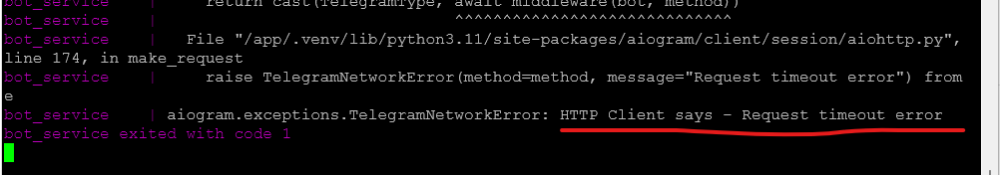
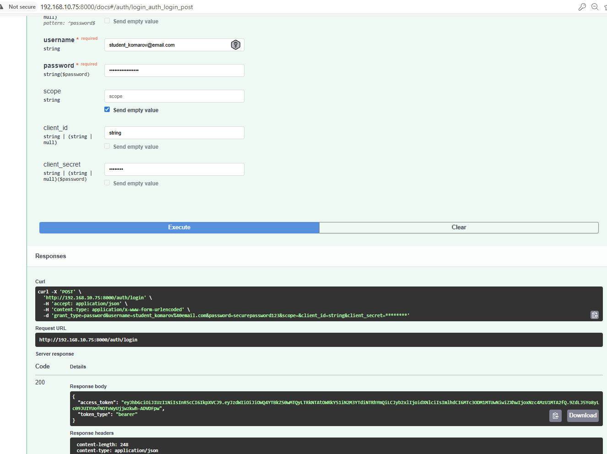
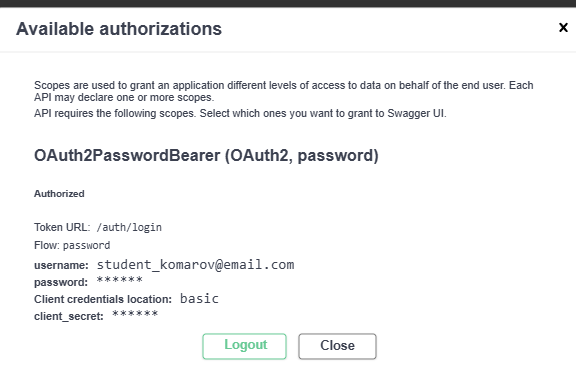
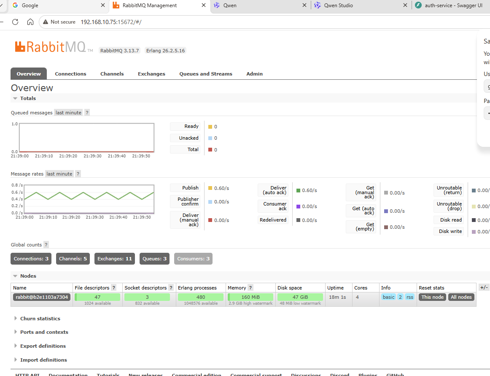
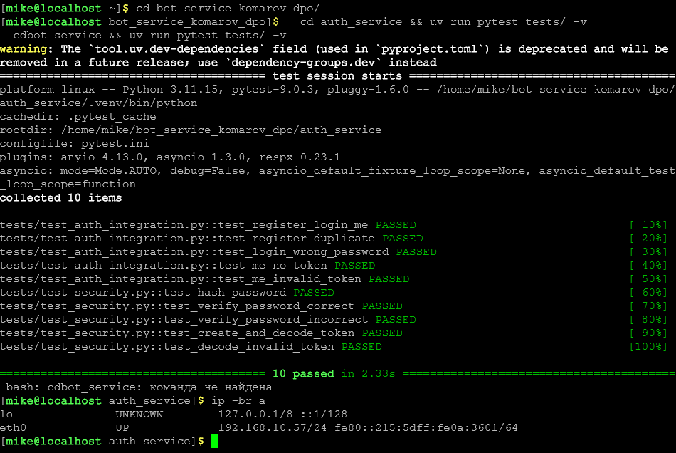

# Двухсервисная система LLM-консультаций

*Хватит 26 баллов, так как возникли проблемы с VPN. Тесты работают.*

Итоговый проект курса. Распределённая система из двух микросервисов:
- **Auth Service** — регистрация, логин, выдача JWT
- **Bot Service** — Telegram-бот с LLM-консультациями через OpenRouter

---

## Архитектура

```
Пользователь → Swagger → Auth Service (FastAPI :8000) → SQLite
                                ↓ JWT
Пользователь → Telegram → Bot Service (aiogram)
                                ↓
                         Redis (хранение JWT)
                                ↓
                         RabbitMQ (очередь задач)
                                ↓
                         Celery Worker → OpenRouter LLM API
```

## Технологии
- Python 3.11, менеджер пакетов: `uv`
- FastAPI, SQLAlchemy async, aiosqlite
- aiogram 3.x, Celery, RabbitMQ, Redis
- OpenRouter API (LLM)
- Docker, docker-compose

---

## Быстрый запуск

### 1. Клонировать репозиторий
```bash
git clone https://github.com/komarovma2017/bot_service_komarov_dpo
cd bot_service_komarov_dpo
```

### 2. Настроить переменные окружения
```bash
# Скопировать примеры конфигурации
cp auth_service/.env.example auth_service/.env
cp bot_service/.env.example bot_service/.env

# Заполнить обязательные значения в .env файлах:
# auth_service/.env: JWT_SECRET
# bot_service/.env: TELEGRAM_BOT_TOKEN, JWT_SECRET (тот же!), OPENROUTER_API_KEY
```

### 3. Запустить через Docker Compose
```bash
docker-compose up --build
```

### 4. Проверить работу
- Swagger Auth Service: http://localhost:8000/docs
- RabbitMQ UI: http://localhost:15672 (guest/guest)

---

## Сценарий работы

1. Открыть Swagger: http://localhost:8000/docs
2. Зарегистрировать пользователя: `POST /auth/register`
   ```json
   { "email": "komarov@email.com", "password": "yourpassword" }
   ```
3. Получить JWT: `POST /auth/login`
4. Проверить профиль: `GET /auth/me` (с Bearer токеном)
5. В Telegram отправить боту: `/token <ваш_jwt>`
6. Написать любое сообщение — получить ответ от LLM

---

## Запуск тестов
```bash
# Auth Service тесты
cd auth_service && uv run pytest tests/ -v

# Bot Service тесты
cd bot_service && uv run pytest tests/ -v
```

---
## Скриншоты

### Swagger Auth Service


### Работа Telegram бота


### RabbitMQ Management UI


### Результаты тестов



